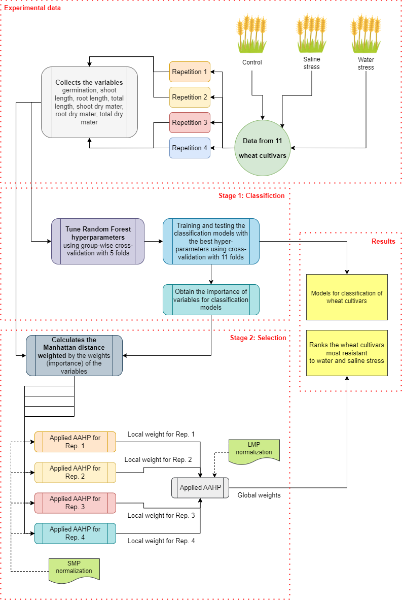

# Classification and selection of wheat cultivars under water and saline stress using advanced machine learning and multicriteria decision analysis

**Abstract:** Water stress and soil salinization are major abiotic factors limiting wheat productivity. Addressing these challenges requires identifying wheat cultivars with enhanced resilience to ensure agricultural sustainability. This study assessed the resilience of eleven commercial wheat cultivars recommended for the Brazilian Cerrado region under water and saline stress using statistical tests, machine learning, and decision-making methods. A 3 × 11 factorial experiment was conducted in a completely randomized design, with three osmotic treatments (control, saline stress, water stress) and four replicates per treatment. Seeds were exposed to iso-osmotic solutions (-0.30 MPa) prepared with polyethylene glycol (PEG-6000) or NaCl to evaluate germination, seedling growth, water content, thousand-seed weight, and emergence rates. Statistical significance was analyzed using the Kruskal–Wallis test and Dwass–Steel–Critchlow–Fligner (DSCF) pairwise comparisons. The Random Forest algorithm classified cultivars based on stress performance, and the Analytic Hierarchy Process (AAHP) ranked them for overall resilience. Significant differences were observed in traits such as germination, shoot length, and biomass under stress. Cultivars like Tbio Sintonia, Tbio Calibre, and Tbio Aton exhibited superior resilience, showing minimal physiological variation between control and stress conditions. This two-stage methodology – combining Random Forest classification and AAHP multicriteria analysis – offers a robust framework for selecting stress-tolerant cultivars. By integrating multiple traits and stress responses, this approach supports breeding programs and farmers in making informed decisions for sustainable agriculture.

**Authors:**
* Alan Mario Zuffo 1
* Bruno Rodrigues de Oliveira 2
* Marco Aparecido Queiroz Duarte 3
* Ricardo Mezzomo 1
* Francisco Charles dos Santos Silva 1
* Leandra Matos Barrozo 1
* Fábio Steiner 3
* Jorge Gonzales Aguilera 3; 
* Gustavo Cardoso Oliveira 1
* Kaiane Maria Martins Moreira 1
* Leandris Argentel-Martínez 4 

* 1 State University of Maranhão, Balsas, MA, Brazil.
* 2 Editora Pantanal, Nova Xavantina, MT, Brazil.
* 3 State University of Mato Grosso do Sul, Cassilândia, MS, Brazil.
* 4 Tecnológico Nacional de Mexico, Campus Valle del Yaqui, Sonora, Mexico
* Correspondence: alan_zuffo@hotmail.com; bruno@editorapantanal.com.br

  **Graphical Abstract**
  
